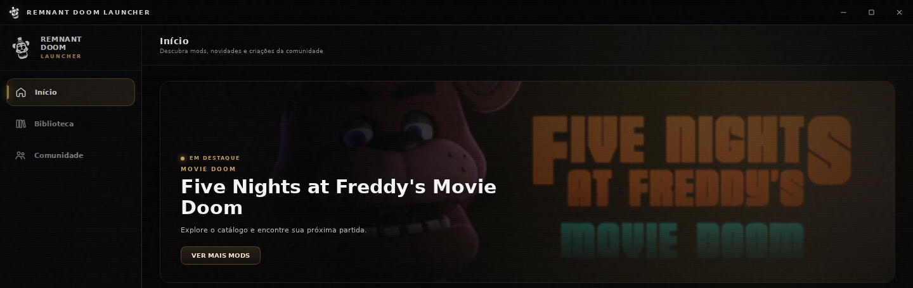

  
  <h1>Remnant Doom Launcher</h1>
  
<strong>Seus mods. Sua biblioteca. Sua próxima noite.</strong>

  
Explore o universo de FNaF Doom e encontre sua próxima partida em um só lugar.

  
<a href="#downloads">↓ Downloads</a> · <a href="#o-launcher">O launcher</a> · <a href="#como-jogar">Como jogar</a> · <a href="#perguntas-frequentes">Dúvidas</a>

---

## O launcher

O **Remnant** reúne um catálogo de mods de FNaF Doom e uma biblioteca para organizar os jogos que você instala. Descubra projetos, consulte suas informações, acompanhe os downloads e abra seus mods pelo launcher.

Recorte da tela inicial. Os destaques e o conteúdo do catálogo podem mudar.

## O que você encontra no Remnant

| | Recurso | Como funciona |
| :---: | --- | --- |
| 🔎 | **Catálogo de mods** | Explore os projetos disponíveis e consulte descrições, imagens e informações antes de baixar. |
| 📚 | **Sua biblioteca** | Encontre os mods instalados e abra seus jogos em um só lugar. |
| ↓ | **Downloads e instalações** | Acompanhe o progresso e cancele uma transferência quando precisar. |
| 🎮 | **Opções de partida** | Nos mods compatíveis, escolha jogar sozinho, criar uma partida ou entrar na de um amigo. |
| ✦ | **Personalização** | Ajuste a aparência, o áudio e o idioma da interface nas configurações. |

## Mods e partidas

Cada mod tem seu próprio conteúdo, requisitos e modos de jogo. Confira as informações do projeto no catálogo para saber o que está disponível.

- **Disponível:** pode oferecer instalação pelo launcher, conforme o download do projeto.
- **Em produção:** o projeto ainda está em desenvolvimento.
- **Agendado:** a liberação está prevista para uma data definida.
- **Página externa:** o acesso ao download acontece na página indicada pelo projeto.

Os mods são baixados separadamente. Instalar o Remnant não instala todo o catálogo no computador.

### Um jeito simples de começar a partida

Alguns mods usam o mini launcher do Remnant para preparar o jogo. As opções exibidas dependem do mod escolhido.

  
  
Exemplo do mini launcher em um mod compatível.

| Modo | Para que serve |
| --- | --- |
| **Jogar sozinho** | Inicie uma partida solo. Alguns mods permitem escolher a noite antes de começar. |
| **Criar partida** | Prepare uma partida cooperativa com as opções que o mod oferece. |
| **Entrar em partida** | Informe o IP e a porta da partida de um amigo. |

O cooperativo depende do suporte do jogo, da compatibilidade entre as versões e da conexão dos jogadores.

## Downloads

Escolha como deseja usar o Remnant no Windows.

| Plataforma | Versão | Formato | Download |
| --- | --- | --- | --- |
| **Windows** | **Setup** — instalador | `.exe` | Aguardando liberação |
| **Windows** | **Portátil** | `.exe` | Aguardando liberação |
| **Linux** | Indisponível | — | Não disponível |

**Setup:** instala o launcher usando um assistente passo a passo.

**Portátil:** abre sem passar pelo assistente de instalação. O launcher ainda pode salvar preferências e criar arquivos temporários no computador; os mods também ocupam espaço em disco.

> Os links serão adicionados quando os arquivos estiverem disponíveis. A versão Linux ainda não foi liberada.

## Como jogar

1. **Escolha sua versão:** baixe o Setup ou a versão portátil quando os downloads forem liberados.
2. **Abra o Remnant:** instale pelo assistente ou execute a versão portátil.
3. **Explore o catálogo:** conecte-se à internet para consultar os mods e suas informações.
4. **Instale um mod:** escolha um projeto com download disponível e acompanhe o progresso.
5. **Comece a jogar:** abra o mod pela biblioteca e escolha as opções de partida, quando oferecidas.

## Perguntas frequentes

<strong>O launcher já vem com os mods?</strong>

Não. Você escolhe quais mods deseja instalar pelo catálogo. Cada download utiliza espaço adicional no computador.

<strong>Qual é a diferença entre Setup e Portátil?</strong>

O Setup usa um assistente para instalar o Remnant. A versão portátil pode ser aberta sem esse assistente. As duas opções são destinadas a usar o launcher; escolha a que preferir.

<strong>Todos os mods têm modo cooperativo?</strong>

Não. Os modos disponíveis dependem de cada projeto. O mini launcher aparece apenas nos mods configurados para usá-lo.

<strong>Preciso estar conectado à internet?</strong>

Você precisa de internet para carregar o catálogo e baixar os mods. Depois de instalado, o funcionamento offline depende do jogo e das opções disponíveis no launcher.

<strong>Meu computador consegue rodar os mods?</strong>

Os requisitos variam de um mod para outro. Consulte as informações de cada projeto e reserve espaço para seus downloads e instalações.

<strong>Posso usar no Linux?</strong>

Ainda não há uma versão Linux disponível. Os downloads desta página são destinados ao Windows.

---

  
  
<strong>REMNANT</strong> Uma nova noite começa aqui.

